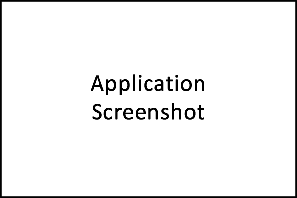

.. astrana-docs documentation master file, created by
   sphinx-quickstart on Mon Jun 24 00:08:16 2019.
   You can adapt this file completely to your liking, but it should at least
   contain the root `toctree` directive.

.. _index:

Welcome to the Astrana Documentation
=================================================

Short intro, lorem Ipsum is simply dummy text of the printing and typesetting industry. 
Lorem Ipsum has been the industry's standard dummy text ever since the 1500s, when an 
unknown printer took a galley of type and scrambled it to make a type specimen book. 
It has survived not only five centuries, but also the leap into electronic typesetting, 
remaining essentially unchanged. 

.. note:: See the :doc:`Development Documentation </developer>` for technical documentation relating to contributing to the development of Astrana software.

Getting Started
---------------

It is a long established fact that a reader will be distracted by the readable content of a page when looking at its layout. 
The point of using Lorem Ipsum is that it has a more-or-less normal distribution of letters, as opposed to using 'Content here, content here', making it look like readable English. 

Many desktop publishing packages and web page editors now use Lorem Ipsum as their default model text, and a search for 'lorem ipsum' will uncover many web sites still in their infancy. 
Various versions have evolved over the years, sometimes by accident, sometimes on purpose (injected humour and the like).

License
-------
Astrana software is licensed under the Mozilla Public License version 2.0.

Please see the `Third Parties </articles/thirdparties>`_ section for details on the third-party files
that we include with releases of Astrana software.